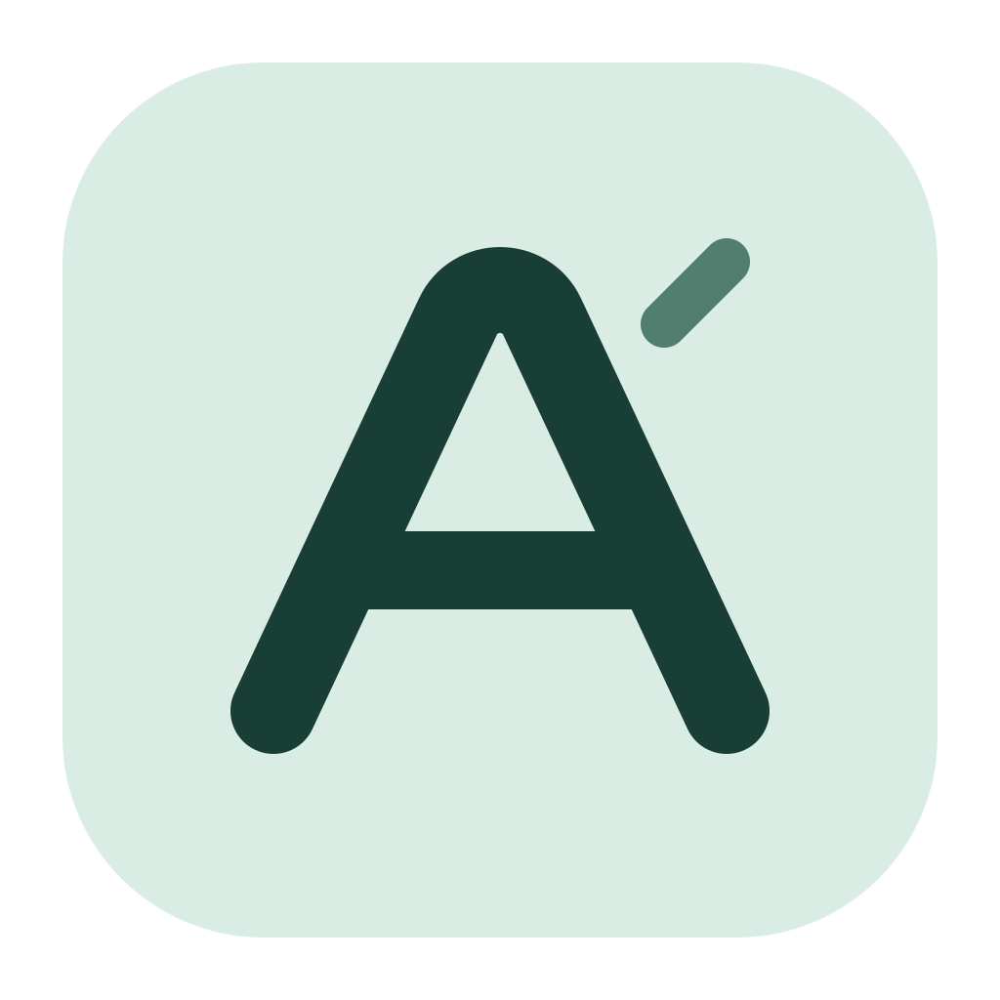
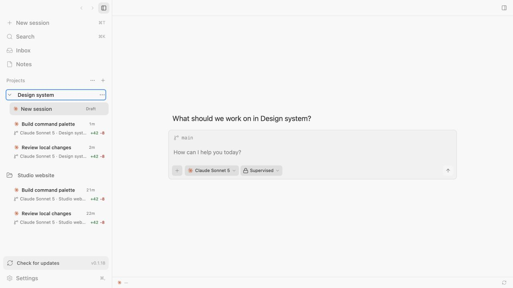

<p align="center">
  
</p>

<h1 align="center">Avenrail</h1>

<p align="center">
  <strong>A desktop UI for your coding agents.</strong>
</p>

<p align="center">
  
</p>

*Workspace preview using illustrative local demo data.*

Works with your subscriptions on Claude Code, Codex, Cursor, OpenCode, Pi, omp, and fx. If they’re installed and logged in, Avenrail can run them. Projects organize your sessions. Chat, review, files, and terminals share one workspace. Avenrail does not sell tokens.

## Install

> Install and log in to at least one provider first:
>
> - [Claude Code](https://claude.com/product/claude-code) - `claude auth login`
> - [Codex](https://developers.openai.com/codex/cli) - `codex login`
> - [Cursor CLI](https://cursor.com/cli) - `agent login`
> - [OpenCode](https://opencode.ai) - `opencode auth login`
> - [Pi](https://pi.dev/) - `npm install -g @earendil-works/pi-coding-agent`
> - [omp](https://omp.sh) - `curl -fsSL https://omp.sh/install | sh`
> - [fx](https://fx.sh) - `curl -fsSL https://fx.sh/setup.sh | bash` then `fx login`

For published builds, check the [project releases](https://github.com/ashish200729/Avenrail/releases). Newly built macOS bundles are named `Avenrail.app` and `Avenrail_<version>_aarch64.dmg`. Older published releases may still carry the previous name. To try the rebrand before it is published, build from source below.

## Upgrading from MonoCode

Avenrail keeps existing sessions, settings, and credentials in place. Compatibility-sensitive installation identifiers retain their old names; see [rebrand compatibility](docs/rebrand-compatibility.md). The codebase and newly built app use Avenrail.

Avenrail originated from [MonoCode](https://github.com/hardbeat920/monocode). Its Git history is preserved, and the upstream repository remains available for selectively bringing in compatible fixes and improvements.

## Some notes

This is very early and you should expect bugs.

Small, focused pull requests are welcome. Anything large is worth an issue first - see [CONTRIBUTING.md](CONTRIBUTING.md).

## Build from source

Supports macOS and Linux.

Need Node.js 20+ and a current stable Rust toolchain. On Linux, ensure standard Tauri prerequisites are installed (e.g. `libwebkit2gtk-4.1-dev`, `libgtk-3-dev`, `libsoup-3.0-dev`, `libjavascriptcoregtk-4.1-dev`).

```bash
npm install
npm run tauri dev
```

## License

[MIT](LICENSE). Provider names and logos are trademarks of their owners - see [NOTICE](NOTICE).
