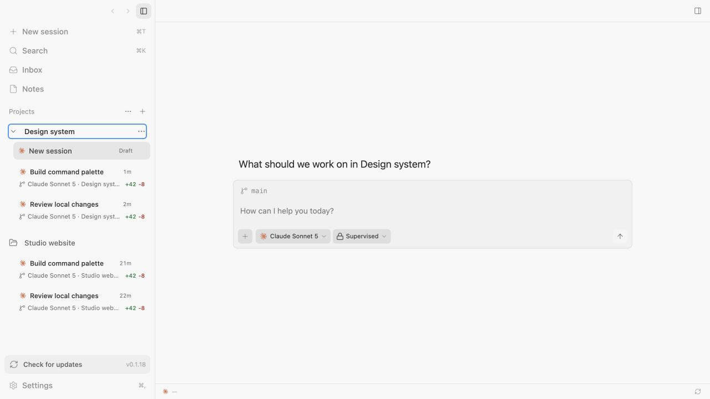

<p align="center">
  
</p>

<h1 align="center">Avenrail</h1>

<p align="center">
  <strong>A desktop UI for your coding agents.</strong>
</p>

<p align="center">
  
</p>

Works with your subscriptions on Claude Code, Codex, Cursor, Grok Build, OpenCode, Antigravity, Pi, omp, fx, and Hermes Agent. If they’re installed and logged in, Avenrail can run them. Tabs are sessions. The composer is the input. Avenrail does not sell tokens.

## Install

> Install and log in to at least one provider first:
>
> - [Claude Code](https://claude.com/product/claude-code) - `claude auth login`
> - [Codex](https://developers.openai.com/codex/cli) - `codex login`
> - [Cursor CLI](https://cursor.com/cli) - `agent login`
> - [Grok Build](https://docs.x.ai/build/overview) - `curl -fsSL https://x.ai/cli/install.sh | bash` then `grok login`
> - [OpenCode](https://opencode.ai) - `opencode auth login`
> - [Antigravity](https://antigravity.google/docs/cli-install) (macOS/Linux) - `curl -fsSL https://antigravity.google/cli/install.sh | bash`, then run `agy` once to sign in
> - [Pi](https://pi.dev/) - `npm install -g @earendil-works/pi-coding-agent`
> - [omp](https://omp.sh) - `curl -fsSL https://omp.sh/install | sh`
> - [fx](https://fx.sh) - `curl -fsSL https://fx.sh/setup.sh | bash` then `fx login`
> - [Hermes Agent](https://github.com/NousResearch/hermes-agent) - macOS/Linux: `curl -fsSL https://hermes-agent.nousresearch.com/install.sh | bash`; Windows PowerShell: `iex (irm https://hermes-agent.nousresearch.com/install.ps1)`; then run `hermes model`

Build Avenrail from source using the instructions below. Published installers, when available, belong on [Avenrail Releases](https://github.com/ashish200729/Avenrail/releases). The upstream Monocode download service distributes Monocode builds.

Linux (x86_64): download the `.deb` or AppImage from [GitHub Releases](https://github.com/ashish200729/Avenrail/releases/latest). Install the `.deb` with `sudo apt install ./Avenrail_*.deb`, or make the AppImage executable with `chmod +x Avenrail_*.AppImage` and run it directly. On Fedora and Enterprise Linux 10, download the `.rpm` from the same release page — see [Fedora / Enterprise Linux packages](#fedora--enterprise-linux-packages) for the one extra repository step Enterprise Linux needs.

Windows (x86_64): download the NSIS installer from [GitHub Releases](https://github.com/ashish200729/Avenrail/releases/latest) and run it.

## Some notes

Experimental remote sessions: run agents on an always-on Windows, Linux, or macOS machine and connect from the desktop. See [remote access setup and current limitations](docs/remote-access.md).

This is very early and you should expect bugs.

### Agent access to Avenrail

Type `/operator` at the start of a composer message to enable Avenrail access in that thread. For example, `/operator start two Codex sessions: one to inspect the API and one to review the UI`, or `/operator list my notes`. The slash picker also offers this command. The transcript shows only the request text in a translucent amber bubble; Avenrail removes the command from the request sent to the agent and supplies the local `app` CLI path and instructions on that turn. Later turns in the same thread can use the CLI without repeating `/operator`; other threads receive no CLI instructions or app access. The CLI can act only during an active agent turn. The agent can run the shown `app --help` command for the exact JSON input fields.

- `models.list` shows available providers, models, settings, and permission modes.
- `sessions.start` opens a tab in the current project with a prompt. Set `placement: "right"` or `placement: "down"` to split the calling session's pane instead; `besideSessionId` selects another visible session pane in the project. Reuse the returned session ID as the next `besideSessionId` to build nested layouts. By default it submits the prompt; set `draft: true` to save it unsent without starting an agent turn. It accepts a provider, model, effort or other model settings, permission mode, and current checkout or new worktree choice. Set `worktreeCwd` to a path from `worktrees.list` for a specific existing checkout. Use `worktrees.create` to create a worktree on a named new or existing local branch, then pass its path as `worktreeCwd`. Omit `runtimeMode` to inherit the calling session's permission mode, or set it explicitly to override. It returns the new session ID as soon as the pane and prompt are accepted, so the agent can move it into a folder immediately.
- `sessions.list` shows project sessions. `sessions.read` returns up to three recent user/assistant exchanges, with a cursor for older exchanges and a per-message character cap. `sessions.send` submits a follow-up to an idle session, while `sessions.draft` saves an unsent message for the user to review. `folders.list` and `folders.move` organize project sessions in sidebar folders, including a new folder.
- `notes.list` returns titles and short previews; `notes.read` returns one full note by ID.

Orchestration workers keep their existing scoped `control` workflow and do not receive this app access.

Small, focused pull requests are welcome. Anything large is worth an issue first - see [CONTRIBUTING.md](CONTRIBUTING.md).

## Build from source

Supports macOS, Linux, and Windows.

Need Node.js 20+ and a current stable Rust toolchain. On Linux, ensure standard Tauri prerequisites are installed (e.g. `libwebkit2gtk-4.1-dev`, `libgtk-3-dev`, `libsoup-3.0-dev`, `libjavascriptcoregtk-4.1-dev`). On Windows, the installer bootstraps the [WebView2](https://developer.microsoft.com/microsoft-edge/webview2/) runtime when it is missing.

```bash
npm install
npm run tauri dev
```

For a checkout with a lockfile, use `npm ci` to install its exact dependencies. `npm run dev:desktop` starts the desktop with a stable preview and checks the installation first; `npm run tauri dev` remains available with hot reload. Both paths now report incomplete installs before launching. Local Rust builds omit debug/incremental artifacts by default to keep disk usage bounded; use Cargo's profile environment variables when native debugging is needed.

Avenrail's development server uses `localhost:1430` so it can run alongside Lori's server on `1420`. On macOS, `npm run build:preview:macos` creates a standalone test app at `target/debug/bundle/macos/Avenrail.app`. This preview uses the built frontend and skips updater artifacts, so testing it requires neither a Vite server nor release updater-signing credentials.

### Ubuntu / Debian packages

On an Ubuntu/Debian workstation, the repository can install the native Tauri prerequisites and build distributable Linux packages directly:

```bash
npm run setup:linux:deb
npm ci
npm run build:linux
```

The Linux build emits `.deb` and AppImage bundles under `target/release/bundle/`.
Tauri loads `src-tauri/tauri.linux.conf.json` automatically for Linux development and builds.

### Fedora / Enterprise Linux packages

On Fedora, or on an Enterprise Linux 10 system (registered RHEL, Rocky, Alma, CentOS Stream, Oracle), install the release `.rpm` from [GitHub Releases](https://github.com/ashish200729/Avenrail/releases/latest). Enterprise Linux needs EPEL first, because `webkit2gtk4.1` is an EPEL package there — CRB is not needed to run Avenrail. On Oracle Linux 10, `epel-release` does not enable `ol10_developer_EPEL`, which is the repository that provides that package. Enable it before installing the rpm:

```bash
# Enterprise Linux 10 only; skip on Fedora.
sudo dnf install -y epel-release   # RHEL: sudo dnf install -y https://dl.fedoraproject.org/pub/epel/epel-release-latest-10.noarch.rpm
# Oracle Linux 10, instead of epel-release:
# sudo dnf install -y oracle-epel-release-el10 dnf-plugins-core
# sudo dnf config-manager --set-enabled ol10_developer_EPEL
sudo dnf install ./Avenrail-*.rpm
```

The `.rpm` declares its own runtime dependencies, so `dnf` pulls the WebKitGTK stack for you. GitHub Releases builds that package on Enterprise Linux 10 so it loads on Fedora and EL 10. Building natively links the system WebKitGTK instead of the Ubuntu-built libraries shipped in the AppImage, which avoids graphics issues (e.g. `Could not create default EGL display`) on newer Mesa/Wayland systems.

To build it yourself instead — which also enables EPEL 10 and CRB automatically, since the -devel packages need CRB:

```bash
npm run setup:linux:fedora
npm ci
npm run build:fedora
```

That emits a `.rpm` under `target/release/bundle/rpm/`, installable with `sudo dnf install ./target/release/bundle/rpm/Avenrail-*.rpm`. EL 9 and older are unsupported (`webkit2gtk4.1-devel` only exists in EPEL 10).

### Troubleshooting on Fedora / Wayland

The portable AppImage bundles Ubuntu-built Wayland libraries that can fail against newer Mesa drivers: the app aborts at startup with `Could not create default EGL display: EGL_BAD_PARAMETER`, or opens a blank window. The native `.rpm` above links the system WebKitGTK stack and does not have this problem — prefer it on Fedora.

### Windows packages

```bash
npm ci
npm run build:windows
```

The Windows build emits an NSIS installer under `target/release/bundle/nsis/`.
Tauri loads `src-tauri/tauri.windows.conf.json` automatically for Windows development and builds.

## License

[MIT](LICENSE). Provider names and logos are trademarks of their owners - see [NOTICE](NOTICE).
